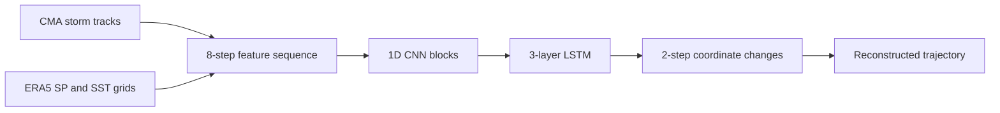

# Typhoon Trajectory Prediction with CNN–LSTM

**Historical storm tracks and ERA5 environmental fields for short-range trajectory prediction.**

[中文说明](README.zh-CN.md) · [Run Guide](docs/RUN_GUIDE.md) · [Training Code](train/train.py) · [Inference](inference/inference.py)

This project explores typhoon trajectory prediction with a CNN–LSTM model in PyTorch. It combines changes in storm position with surface pressure (SP) and sea surface temperature (SST) fields. The repository includes data preparation notebooks, training and inference scripts, saved model checkpoints, and example trajectory maps.

The complete project is maintained on **`main`**. The original implementation and research artifacts are preserved; the [run guide](docs/RUN_GUIDE.md) describes the environment and limitations of this historical experiment.

## Example Trajectories

| Carmen | Kujira |
| :---: | :---: |
|  |  |

Original figures stored in the repository. Red points show the original track; yellow points show the predicted track. These examples illustrate the output format and are not an aggregate accuracy evaluation.

## Model Overview

Each input window contains **8 historical observations**. For each observation, the model combines normalized latitude/longitude changes with flattened SP and SST grids. Three temporal convolution blocks feed a three-layer LSTM, followed by a head that predicts **2 future coordinate changes**. Separate model objects are used for latitude and longitude.



The grid values are flattened into features before entering the 1D CNN. Architecture and training details are in [`train/train.py`](train/train.py); known training and evaluation issues are documented in the [run guide](docs/RUN_GUIDE.md#reproducibility-notes).

## Repository Layout

| Path | Contents |
| --- | --- |
| [`CMABSTdata/`](CMABSTdata/) | CMA best-track text files, 1949–2023 |
| [`data_preprocess/`](data_preprocess/) | Preparation notebooks, track CSV files, SP/SST grid JSON files, and supporting figures |
| [`EAR5/`](EAR5/) | ERA5 request records and a sample GRIB file; original directory spelling retained |
| [`train/train.py`](train/train.py) | CNN–LSTM definition and training loop |
| [`train/model/`](train/model/) | Saved latitude and longitude model checkpoints |
| [`inference/`](inference/) | Inference script and notebook, trajectory CSV files, and example maps |
| [`requirements.txt`](requirements.txt) | Original Linux environment export, retained as a reference |

## Getting Started

Clone the default branch:

```bash
git clone --branch main https://github.com/Will1202/Typhoon-Trajectory-Prediction-Based-On-CNN-LSTM-model-main.git
cd Typhoon-Trajectory-Prediction-Based-On-CNN-LSTM-model-main
```

The historical environment used **Python 3.10** and **PyTorch 2.1**. The existing `requirements.txt` mixes Conda build records and pip packages, so it is not a pip requirements file. See the [environment setup](docs/RUN_GUIDE.md#environment-setup) before running the scripts.

With a compatible environment, the bundled processed data and checkpoints provide the starting point for the Carmen example:

```bash
cd inference
python inference.py
```

The script reads paths relative to `inference/` and writes trajectory CSV files and `Carmen.png`, replacing the bundled example outputs. See [inference and custom inputs](docs/RUN_GUIDE.md#inference-and-custom-inputs) for input requirements and checkpoint compatibility.

For retraining, read the [training notes](docs/RUN_GUIDE.md#training) first. The original training script has known target-selection and evaluation issues that need to be addressed before using a new run as a benchmark.

## Data Sources

- **CMA Tropical Cyclone Best Track Dataset:** [dataset description](https://tcdata.typhoon.org.cn/en/zjljsjj.html).
- **ERA5 hourly data on single levels:** [Copernicus Climate Data Store](https://cds.climate.copernicus.eu/datasets/reanalysis-era5-single-levels?tab=overview). This project uses surface pressure and sea surface temperature.

The preparation workflow is recorded in [`data_preprocess/data_preprocess.ipynb`](data_preprocess/data_preprocess.ipynb). Rebuilding the data requires local path configuration, matching timestamps, and access to the source datasets; see [data preparation](docs/RUN_GUIDE.md#data-preparation).

## License and Attribution

The repository retains its original [MIT license](LICENSE) and copyright notice. Please acknowledge the original code and the CMA and Copernicus data sources when building on this work. Consult each data provider's terms for dataset reuse.
