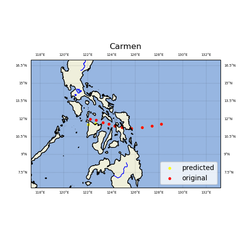
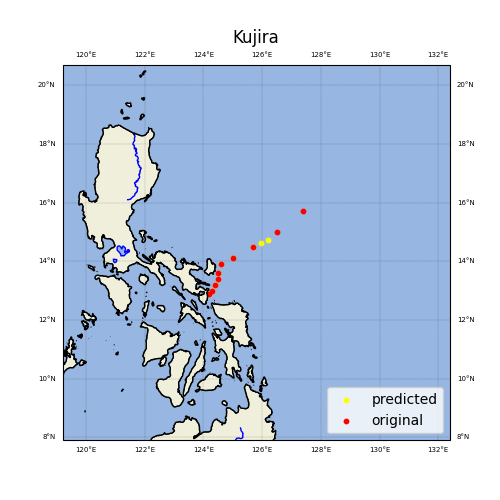
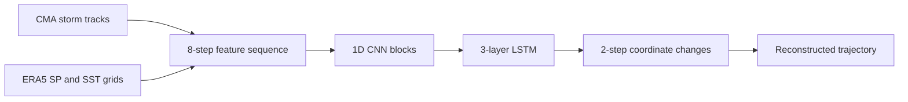

# Typhoon Trajectory Prediction with CNN–LSTM

**Historical storm tracks and ERA5 environmental fields for short-range trajectory prediction.**

[中文说明](README.zh-CN.md) · [Run Guide](docs/RUN_GUIDE.md) · [Training Code](train/train.py) · [Inference](inference/inference.py)

This project explores typhoon trajectory prediction with a CNN–LSTM model in PyTorch. It combines changes in storm position with surface pressure (SP) and sea surface temperature (SST) fields. The repository includes data preparation notebooks, training and inference scripts, saved model checkpoints, and example trajectory maps.

The [run guide](docs/RUN_GUIDE.md) covers environment setup, data preparation, training, and inference.

## Example Trajectories

| Carmen | Kujira |
| :---: | :---: |
|  |  |

Trajectory visualizations for Carmen and Kujira. Red points show the observed track; yellow points show the predicted track.

## Model Overview

Each input window contains **8 historical observations**. For each observation, the model combines normalized latitude/longitude changes with flattened SP and SST grids. Three temporal convolution blocks feed a three-layer LSTM, followed by a head that predicts **2 future coordinate changes**. Separate model objects are used for latitude and longitude.



The grid values are flattened into features before entering the 1D CNN. See [`train/train.py`](train/train.py) for the architecture and the [run guide](docs/RUN_GUIDE.md#experiment-configuration) for experiment configuration.

## Repository Layout

| Path | Contents |
| --- | --- |
| [`CMABSTdata/`](CMABSTdata/) | CMA best-track text files, 1949–2023 |
| [`data_preprocess/`](data_preprocess/) | Preparation notebooks, track CSV files, SP/SST grid JSON files, and supporting figures |
| [`EAR5/`](EAR5/) | ERA5 request records and a sample GRIB file |
| [`train/train.py`](train/train.py) | CNN–LSTM definition and training loop |
| [`train/model/`](train/model/) | Saved latitude and longitude model checkpoints |
| [`inference/`](inference/) | Inference script and notebook, trajectory CSV files, and example maps |
| [`requirements.txt`](requirements.txt) | Linux environment package reference |

## Getting Started

Clone the default branch:

```bash
git clone --branch main https://github.com/Will1202/Typhoon-Trajectory-Prediction-CNN-LSTM.git
cd Typhoon-Trajectory-Prediction-CNN-LSTM
```

The recorded environment uses **Python 3.10** and **PyTorch 2.1**. The `requirements.txt` file is a Conda environment export; use the [environment setup guide](docs/RUN_GUIDE.md#environment-setup) to select and install the packages for your platform.

With a compatible environment, the bundled processed data and checkpoints provide the starting point for the Carmen example:

```bash
cd inference
python inference.py
```

The script reads paths relative to `inference/` and writes trajectory CSV files and `Carmen.png`, replacing the bundled example outputs. See [inference and custom inputs](docs/RUN_GUIDE.md#inference-and-custom-inputs) for input requirements and checkpoint compatibility.

For training, see the [training workflow](docs/RUN_GUIDE.md#training) and [experiment configuration](docs/RUN_GUIDE.md#experiment-configuration).

## Data Sources

- **CMA Tropical Cyclone Best Track Dataset:** [dataset description](https://tcdata.typhoon.org.cn/en/zjljsjj.html).
- **ERA5 hourly data on single levels:** [Copernicus Climate Data Store](https://cds.climate.copernicus.eu/datasets/reanalysis-era5-single-levels?tab=overview). This project uses surface pressure and sea surface temperature.

The preparation workflow is recorded in [`data_preprocess/data_preprocess.ipynb`](data_preprocess/data_preprocess.ipynb). Rebuilding the data requires local path configuration, matching timestamps, and access to the source datasets; see [data preparation](docs/RUN_GUIDE.md#data-preparation).

## License and Attribution

Code is distributed under the [MIT license](LICENSE). Please retain the copyright notice and acknowledge the CMA and Copernicus data sources when building on this work. Consult each data provider's terms for dataset reuse.
